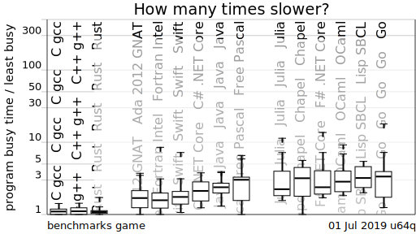
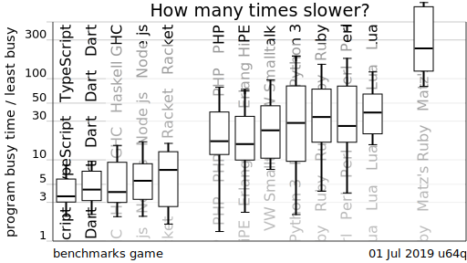

# Rust Lang 101
## Tianyou Li

---

## What is Rust?

Rust is a **multi-paradigm** system level programming language that supports functional, imperative, object-oriented, and concurrent-action programming styles. 

---

## Why Rust?

- Performance
  
  Rust is blazingly fast and memory-efficient: with no runtime or garbage collector, it can power performance-critical services, run on embedded devices, and easily integrate with other languages.

- Reliability
  
  Rust’s rich type system and ownership model guarantee memory-safety and thread-safety — and enable you to eliminate many classes of bugs at compile-time.

- Productivity
  
  Rust has great documentation, a friendly compiler with useful error messages, and top-notch tooling — an integrated package manager and build tool, smart multi-editor support with auto-completion and type inspections, an auto-formatter, and more.

---

## Performance

 


---

## Agenda

- Incomplete Syntax Guide
- Tools
- Ecosystem
- Resources
- Q & A

---

## Hello Rust
```
fn main() {
    let name="Rust";
    println!("Hello, {}!", name);
}
```

---

## sonic/src/main.rs

```
// Sonic
//
// Fast, lightweight and schema-less search backend
// Copyright: 2019, Valerian Saliou <valerian@valeriansaliou.name>
// License: Mozilla Public License v2.0 (MPL v2.0)

#![cfg_attr(feature = "benchmark", feature(test))]

#[macro_use]
extern crate log;
#[macro_use]
extern crate clap;
#[macro_use]
extern crate lazy_static;
#[macro_use]
extern crate serde_derive;
extern crate byteorder;
extern crate fst;
extern crate fst_levenshtein;
extern crate fst_regex;
extern crate hashbrown;
extern crate linked_hash_set;
#[cfg(unix)]
extern crate nix;
extern crate radix;
extern crate rand;
extern crate regex;
extern crate regex_syntax;
extern crate rocksdb;
extern crate toml;
extern crate twox_hash;
extern crate unicode_segmentation;
extern crate whatlang;
#[cfg(windows)]
extern crate winapi;

#[cfg(feature = "alloc-jemalloc")]
extern crate jemallocator;

mod channel;
mod config;
mod executor;
mod lexer;
mod query;
mod stopwords;
mod store;
mod tasker;

use std::ops::Deref;
use std::str::FromStr;
use std::thread;
use std::time::Duration;

use clap::{App, Arg};
use log::LevelFilter;

use channel::listen::{ChannelListen, ChannelListenBuilder};
use channel::statistics::ensure_states as ensure_states_channel_statistics;
use config::config::Config;
use config::logger::ConfigLogger;
use config::reader::ConfigReader;
use store::fst::StoreFSTPool;
use store::kv::StoreKVPool;
use tasker::runtime::TaskerBuilder;
use tasker::shutdown::ShutdownSignal;

struct AppArgs {
    config: String,
}

#[cfg(feature = "alloc-jemalloc")]
#[global_allocator]
static ALLOC: jemallocator::Jemalloc = jemallocator::Jemalloc;

pub static LINE_FEED: &'static str = "\r\n";

pub static THREAD_NAME_CHANNEL_MASTER: &'static str = "sonic-channel-master";
pub static THREAD_NAME_CHANNEL_CLIENT: &'static str = "sonic-channel-client";
pub static THREAD_NAME_TASKER: &'static str = "sonic-tasker";

macro_rules! gen_spawn_managed {
    ($name:expr, $method:ident, $thread_name:ident, $managed_fn:ident) => {
        fn $method() {
            debug!("spawn managed thread: {}", $name);

            let worker = thread::Builder::new()
                .name($thread_name.to_string())
                .spawn(|| $managed_fn::new().run());

            // Block on worker thread (join it)
            let has_error = if let Ok(worker_thread) = worker {
                worker_thread.join().is_err()
            } else {
                true
            };

            // Worker thread crashed?
            if has_error == true {
                error!("managed thread crashed ({}), setting it up again", $name);

                // Prevents thread start loop floods
                thread::sleep(Duration::from_secs(1));

                $method();
            }
        }
    };
}

lazy_static! {
    static ref APP_ARGS: AppArgs = make_app_args();
    static ref APP_CONF: Config = ConfigReader::make();
}

gen_spawn_managed!(
    "channel",
    spawn_channel,
    THREAD_NAME_CHANNEL_MASTER,
    ChannelListenBuilder
);
gen_spawn_managed!("tasker", spawn_tasker, THREAD_NAME_TASKER, TaskerBuilder);

fn make_app_args() -> AppArgs {
    let matches = App::new(crate_name!())
        .version(crate_version!())
        .author(crate_authors!("\n"))
        .about(crate_description!())
        .arg(
            Arg::with_name("config")
                .short("c")
                .long("config")
                .help("Path to configuration file")
                .default_value("./config.cfg")
                .takes_value(true),
        )
        .get_matches();

    // Generate owned app arguments
    AppArgs {
        config: String::from(matches.value_of("config").expect("invalid config value")),
    }
}

fn ensure_states() {
    // Ensure all statics are valid (a `deref` is enough to lazily initialize them)
    let (_, _) = (APP_ARGS.deref(), APP_CONF.deref());

    // Ensure per-module states
    ensure_states_channel_statistics();
}

fn main() {
    let _logger = ConfigLogger::init(
        LevelFilter::from_str(&APP_CONF.server.log_level).expect("invalid log level"),
    );

    let shutdown_signal = ShutdownSignal::new();

    info!("starting up");

    // Ensure all states are bound
    ensure_states();

    // Spawn tasker (background thread)
    thread::spawn(spawn_tasker);

    // Spawn channel (foreground thread)
    thread::spawn(spawn_channel);

    info!("started");

    shutdown_signal.at_exit(move |signal| {
        info!("stopping gracefully (got signal: {})", signal);

        // Teardown Sonic Channel
        ChannelListen::teardown();

        // Perform a KV flush (ensures all in-memory changes are synced on-disk before shutdown)
        StoreKVPool::flush(true);

        // Perform a FST consolidation (ensures all in-memory items are synced on-disk before \
        //   shutdown; otherwise we would lose all non-consolidated FST changes)
        StoreFSTPool::consolidate(true);

        info!("stopped");
    });
}
```

---

## Back to Hello Rust
```
fn main() {
    let name="Rust";
    println!("Hello, {}!", name);
}
```
- Do you have any questions? 
  - Return value?
  - Arguments?
  - Variable Type?
  - Function? 'println!'?
  - How to print '{}'?
  - How many bytes for the compiled binary?
  - The linkage of the compiled binary?

